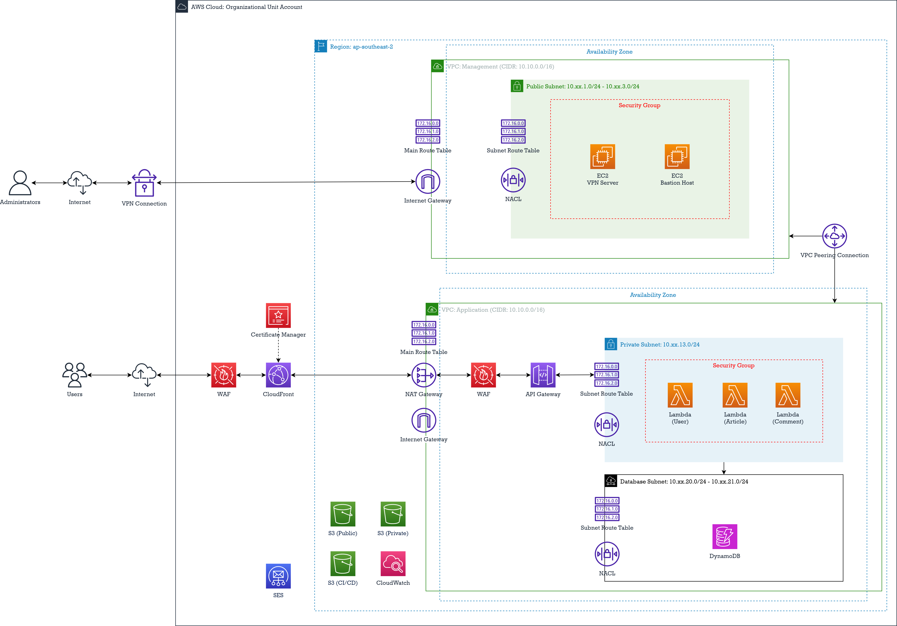

# Terraform AWS Infrastructure

This project provisions a complete AWS infrastructure using Terraform. The architecture includes services such as Lambda, DynamoDB, API Gateway, CloudFront, EC2, S3, and CloudWatch, as shown in the diagram below.

## Architecture Diagram



## Modules

The project is modularized into the following components:

### 1. **Lambda**
- Provisions an AWS Lambda function with associated IAM roles and policies.
- Configurable environment variables, VPC settings, and tags.

### 2. **DynamoDB**
- Creates DynamoDB tables for `users`, `articles`, and `comments`.
- Configurable table names and tags.

### 3. **CloudWatch**
- Sets up CloudWatch log groups and alarms for monitoring Lambda functions.

### 4. **S3**
- Provisions an S3 bucket with configurable ACL and tags.

### 5. **API Gateway**
- Creates an API Gateway with a resource path and integration with the Lambda function.

### 6. **CloudFront**
- Configures a CloudFront distribution with an S3 bucket as the origin.

### 7. **EC2**
- Provisions a bastion host in a public subnet with a security group allowing SSH access.

## Prerequisites

- Terraform installed on your local machine.
- AWS credentials configured for Terraform to use.

## Usage

1. Clone the repository:
   ```bash
   git clone https://github.com/duynguyen3ptn/terraform-excercise.git
   cd terraform-aws-infra
   ```

2. Initialize Terraform:
   ```bash
   terraform init
   ```

3. Review the execution plan:
   ```bash
   terraform plan
   ```

4. Apply the configuration:
   ```bash
   terraform apply
   ```

5. Destroy the infrastructure (if needed):
   ```bash
   terraform destroy
   ```
